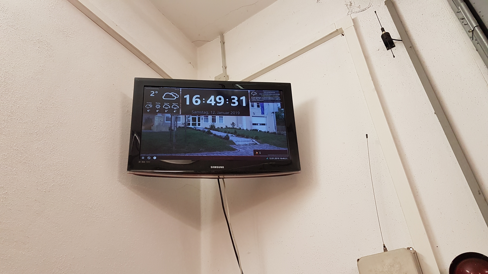
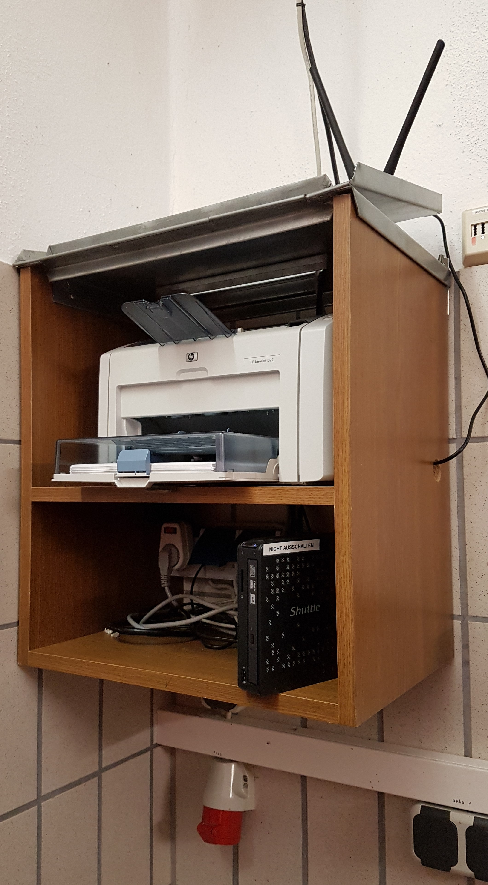
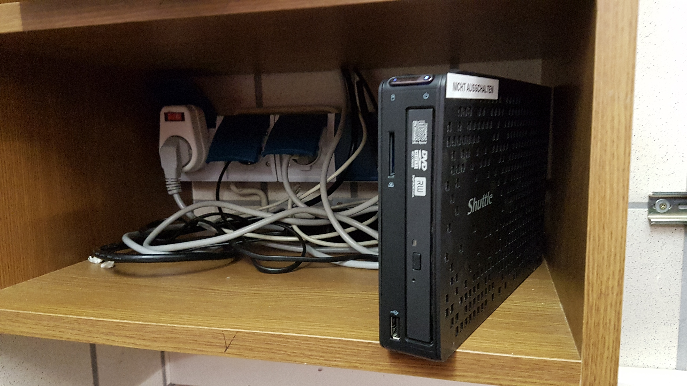
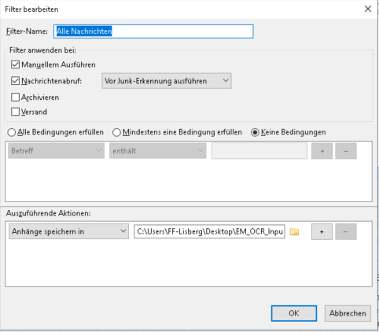
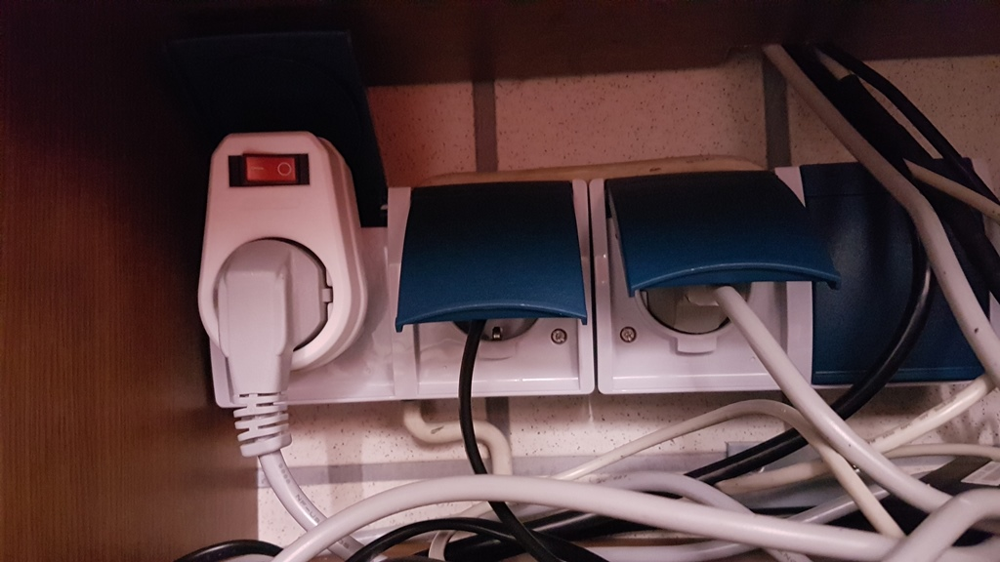

# ff-lisberg-monitor
Dieses Repository enthält eine Dokumentation über Einsatz Monitor bei FF Lisberg und aller von uns gebauten Scripts.

Der Einsatz Monitor für unsere Feuerwehr zeigt in der Gerätehalle den aktuellen Einsatz an, sodass jeder Kamerad weiß wo er hin muss und was ihm am Einsatzort erwartet. Im folgenden ist zu lesen, wie wir das umgesetzt haben.

## Übersicht Einsatzablauf
Unsere Leitstelle Bamberg verschickt ein Einsatzfax, in dem alle relevanten und bekannten Daten für den Einsatz enthalten sind, zu jedem Einsatz an eine Telefonnummer. Eine Fritzbox verwaltet die Telefonnummer und empfängt auch das Fax. Das Fax werten wir maschinell aus und verwenden die Informationen für die Anzeige in der Gerätehalle. Zusätzlich wird das Fax automatisch gedruckt, sodass der Kommandant oder der Gruppenführer die Informationen gleich mit zum Einsatz nehmen kann.

### Beschreibung der Knoten

In diesem Kapitel befinden sich ein paar kurze Beschreibungen zur Hardwareausstattung.

#### Fritz.Box

Der aktuelle Internet-Router ist eine **Fritz.Box 7390**. Diese stellt via VDSL einen Zugang zum Internet her, spannt ein WLAN-Netzwerk für das Feuerwehrhaus auf und kümmert sich um den Faxempfang von der Leitstelle.

#### Mini PC

Der "Mini PC" ist ein handelsüblicher PC mit einem Windows 10. Windows haben wir deshalb gewählt, weil das für die Software "Einsatz Monitor" erforderlich ist. Der "Mini PC" ist deshalb "Mini", weil er wirklich sehr kompakt ist und auch entsprechend stromsparend arbeiten kann - immerhin läuft dieser Rechner 24/7.

Die Hardware-Eigenschaften des Rechners sind:
- Intel Atom CPU D2550 @ 1,86 GHz
- 4 GB RAM
- 465 GB HDD
- Grafikkarte AMD Radeon HD 6430M
- WLAN via USB-Adapter

#### Bildschirm

Als Bildschirm verwenden wir einen handelsüblichen Flachbildfernseher mit HDMI-Eingang. Dieser ist mit einer Wandhalterung auf etwa 3 Metern Höhe befestigt.

Damit der Bildschirm nicht 24/7 laufen muss, haben sich unsere findigen Kameraden eine Schaltung einfallen lassen, sodass der Monitor nur bei einem Einsatz oder nach manueller Schaltung aktiv ist. Siehe auch Kapitel [Schaltung für Monitor](#schaltung-für-monitor).

#### Drucker

Der Drucker ist ein **HP Laserjet 1022**. Ein Laserdrucker deshalb, weil diese Art von Drucker im Vergleich zu Tintendruckern sehr langlebig sind und es keine Gefahr gibt, dass Tintenpatronen eintrocknen. Zudem ist der Ausdruck wasserfest - da wir den Einsatzbefehl drucken und mitnehmen, ist das natürlich ein Vorteil.

#### E-Mail-Server

Der E-Mail-Server ist angemietet über den Provider der Domain **ff-lisberg.de**. Ein E-Mail-Server ist überhaupt erst notwendig, da wir das Fax von der Leitstelle via der Fritz-Box an eine E-Mail-Adresse schicken und von dort die Verteilung des Einsatzberichts an den Einsatz Monitor vornehmen, sowie eine Weiterleitung an den 1. und 2. Kommandanten (als Backup).

Damit das sicher ist, verwenden wir hier nur E-Mail-Adressen der **ff-lisberg.de** Domain, verwenden hinreichend sichere Passwörter und übertragen Daten nur verschlüsselt.

### Konfiguration der Programme

In diesem Kapitel ist beschrieben, wie die einzelnen Knoten bzw. Programme konfiguriert sind. Dabei wird nicht immer die exakte Konfiguration angegeben, sondern nur angedeutet. Zum einen gibt es Einstellungen, die bei jeder Installation angepasst werden müssen und zum anderen sind die Einstellungen sicherheitsrelevant (bspw. Passwörter).

#### Fritz.Box

Die Fritz.Box baut einen Internetzugang auf und hält diesen offen. Es erfolgt Nachts zwischen 2 und 5 Uhr einen Zwangstrennung des Providers, zu der wir für einen kurzem Zeitraum offline sind und keine Faxe empfangen können.

Als Netzwerkverbindung zwischen Fritz.Box (steht im Schulungsraum) und der Gerätehalle verwenden wir die WLAN-Schnittstelle. Das WLAN muss auf halbem Wege mittels eines Repeaters verstärkt werden.

Die Telefoniefunktion der Fritz.Box ist so konfiguriert, dass Faxe empfangen werden können. Eingehende Faxe werden als E-Mail (mit dem Fax als PDF-Anhang) verschlüsselt an eine E-Mail-Adresse der Domain **ff-lisberg.de** versendet.

#### E-Mail-Server

Am E-Mail-Server gibt es im wesentlichen zwei wichtige Einstellungen. Das ist zum einen die E-Mail-Adresse selbst und zum anderen geeignete Filtereinstellungen, sodass nur tatsächliche Einsatzmeldungen verarbeitet werden.

Die E-Mail-Adresse selbst ist mit einem modernen Provider sehr schnell erledigt. Dafür gibt es Konfigurationsmasken und es nicht nötig Konfigurationsdatien zu editieren. Wichtig ist hier nur ein ausreichend sicheres Passwort zu verwenden - unseres hat eine Qualität von 155 Bit, was einer Länge von 28 Zeichen entspricht.

Da prinzipiell jeder eine E-Mail an diese Adresse schicken kann und wir ja nur wollen, dass eine Einsatzmeldung nur bei einem echten Einsatz erfolgt, brauchen wir noch geeignete Filterregeln. Das heißt, dass eine eingehend E-Mail geprüft wird und wenn diese nicht die von uns definierten Merkmale erfüllt, wird sie sofort gelöscht. Damit unser Schutz nicht umgangen werden kann, geben wir hier nur so viel Preis: Es ist ein Geheimnis, das unsere Fritz.Box beim Versand der E-Mail mit hinterlegt gegen das wir serverseitig prüfen.  

#### Thunderbird

Am Mini PC verwenden wir das Proramm "Thunderbird" zum E-Mail Empfang. Das Programm ist etabliert, gilt im allgemeinen als stabil und holt regelmäßig neue E-Mails vom Server ab. Es hat den Nachteil, dass es für den Zweck (E-Mail-Empfang und extrahieren der PDF-Anlage) relativ viel Hauptspeicher benötigt. Es kann gut sein, dass wir den Thunderbird mittelfristig mit einem Script ersetzen, das die gleiche Aufgabe erfüllt - das Script müsste jedoch regelmäßig getriggert werden.

Am Thunderbird ist als Konfiguration der E-Mail-Account hinterlegt, den wir vorher angelegt haben. Nun müssen wir noch eine Regel (in Thunderbird heißt das "Filter") definieren, die automatisch den PDF-Anhang eingehender E-Mails in einen Ordner auf der Festplatte extrahiert. Leider beherrscht das der Thunderbird standardmäßig nicht. Mit der Extension "FiltaQuilla" kann so eine Regel allerdings angelegt werden.

Es gibt ein Problem mit Thunderbird, wenn der Rechner in der Nacht automatisch neu gestartet wird. Wir müssen sicher stellen, dass auch der Thunderbird gestartet wird, sonst werden ja keine E-Mails empfangen. Leider ist es so, dass sich das Programm in den Vordergrund legt. Das heißt im Falle eines Einsatzes sehen wir das Thunderbird Programm anstelle der Information wo wir tatsächlich hin fahren müssen. Um das zu umgehen, müssen wir noch die Extension "MinimizeToTray revived" installieren. Diese Extension legt Thunderbird in den SystemTray (die Symbole unten rechts neben der Uhr), wenn die Applikation minimiert ist.

Damit der Thunderbird tatsächlich automatisch nach Windows Neustart minimiert gestartet wird, brauchen wir noch ein kleines Script, das den Thunderbird minimiert. Das Script (PowerShell) startet Thunderbird, wartet 15 Sekunden und führt dann über die Windows-API die Minimieren Funktion des Fensters aus.
Script: [Script](./tb-start.ps1)

#### EM_OCR

Wir verwenden die Software EM OCR von Stefan Seider um das ankommende Fax zu analysieren und auszuwerten. Das ließe sich zwar auch ohne machen, ist allerdings in Zusammenarbeit von ghostscript, tesseract und Einsatz Monitor eher sperrig und fehleranfällig. EM OCR leistet hier eine sehr gute Unterstützung.

Neben EM OCR müssen auch noch die Software-Pakete tesseract und ghostscript installiert werden. Ghostscript verwandelt die PDF Datei in eine TIF Datei, die von tesseract weiter verarbeitet werden kann. Tesseract sucht in der TIF Datei nach Text und versucht diesen auszuwerten. Um seine Arbeit hier in Bezug auf den Einsatzfaxen bestens anwenden zu können, ist es nötig die Datei "alarm.traineddata" bereit zu stellen.

Link zu EM OCR: https://feuersoftware.com/forum/index.php?thread/2125-em-ocr-einsatzmonitor-pdf-tiff-txt-fax-konverter-mit-ordner%C3%BCberwachung/

Folgende Einstellungen haben wir im EM OCR vorgenommen:
- "Eingangs-Ordner": Zeigt auf den Ordner, in den der Thunderbird die PDF-Anhänge eingehender E-Mails extrahiert
- "Ausgabe-Ordner": Zeigt auf den Ordner, den der Einsatz Monitor als "Input Ordner" benutzt. Das ist üblicherweise C:\Users\<Profil>\Einsatz_Monitor\Text_Input
- "Archiv-Ordner": In diesem Ordner legt EM OCR die PDF-Dateien ab, die bereits bearbeitet wurden. Dabei bekommen die Dateien einen neuen Dateinamen, der das aktuelle Datum und die aktuelle Uhrzeit enthält
- "Tesseract-Pfad": Hier muss die tesseract.exe aus der tesseract Installation angegeben werden
- "GhostScript-Pfad": Hier muss die ghostscript.exe aus der ghostscript Installation angegeben werden (heißt überlichweise gswin64c.exe)
- "GS / Tesseract Einstellungen": Hier verwenden wir die Standardeinstellungen
- "Druckeinstellungen": Hier legen wir fest, dass auf unserem angeschlossenen Drucker der Einsatz auch ausgedruckt wird
- "EM-OCR mit Windows starten": Der Haken ist bei uns gesetzt, damit auch EM OCR nach jedem Neustart des Rechners wieder automatisch zur Verfügung steht
- "Service starten bei Programmstart": Starten von EM OCR alleine reicht nicht aus; der Service muss aktiv sein, damit der Eingangs-Ordner tatsächlich überwacht wird
- "Minimiert starten": Natürlich starten wir auch minimiert, damit sich der EM OCR nicht über den Einsatz Monitor legt
- "AutoParser Einstellungen": Hier definieren wir, welche Felder aus dem Einsatzfax ausgewertet werden und welchen Namen die Werte für die Auswertung im Einsatz Monitor bekommen*
    - Straße -> Straße
    - Abschnitt -> Ortsteil
    - Ort -> Ort
    - Objekt -> Objekt
    - Schlagwort -> Sachverhalt
    - Einsatznummer -> Einsatznummer
    - Prio -> Zusatzinformation1
    - --> Jeweils ist der Haken bei "n/A" gesetzt, da es sein kann, dass die Leitstelle gewissen Informationen nicht immer überträgt

*) Faktisch erstellt EM OCR eine Textdatei aus dem PDF und diese Textdatei wird dem Einsatz Monitor zur Verfügung gestellt. Der Einsatz Monitor muss freilich diese Datei erneut auswerten.

#### Einsatz Monitor

Als Anzeige Software eines Einsatzes verwenden wir den Einsatz Monitor von der Feuer Software GmbH (https://feuersoftware.com/forum/wcf/index.php?einsatzmonitor/). Diese Software wird dankenswerterweise von der Firma kostenfrei zur Verfügung gestellt.

Nach der Installation haben wir folgende Konfiguration am Einsatz Monitor vorgenommen:
- Auswertung
    - Bei der "Auswertung" haben wir die "File Überwachung" aktiviert
    - Als Pattern haben wir ein neues angelegt, mit folgendem Inhalt: [Einsatz Monitor Pattern](./Einsatz_Monitor_Pattern_ILS_Bamberg.txt)
- Einstellungen
    - Kategorie "Einsatz": Hier nehmen wir die Standardeinstellungen und lassen die Anzeige nach 45 Minuten zurück setzen
    - Kategorie "Hintergrund": Als Hintergrundbild haben wir ein Bild unseres FF Hauses eingerichtet
    - Kategorie "Karten":
        - Provider: Open Street Map
        - Marker: Rot
        - Zoom: 15
        - Breite: 31%
        - Routenanzeige: ON
        - Helikoptermodus: OFF
        - Hydranten anzeigen: OFF
    - Kategorie "Organisation": Hier haben wir die "FF Lisberg" und die Adresse eingetragen

Zu guter letzt ist natürlich auch der Einsatz Monitor in der Autostart Gruppe von Windows hinterlegt, damit die Software nach jedem Rechnerneustart automatisch startet.

### Beschreibung der Schritte

#### 1 - Fax von Leitstelle

#### 2 - Mail mit PDF

#### 3 - Prüfung auf validem Absender

#### 4 - Lösche Mail bei fehlgeschlagener Prüfung

#### 5/6 - Prüfe auf neue Mails

#### 7 - Extrahiere PDF

#### 8/9 - Prüfe auf neue PDF

#### 10 - Konvertiere PDF in Textdatei

#### 11 - Werte Textdatei aus

#### 12 - Erstelle Datei für Einsatz Monitor

#### 13 - Kopiere Datei für Einsatz Monitor

#### 14 - Drucke Einsatz PDF

#### 15 - Verschiebe PDF in Archiv

#### 16/17 - Prüfe auf neue Datei

#### 18 - Auswertung Textdatei

#### 19 - Anzeige Einsatz

#### 20 - Drucke Einsatzbericht Vorlage

#### 21 - Setze Anzeige zurück

## Neustart um 4 Uhr
- Vorbeugung Memory Leak
- Updates Einsatz Monitor
- Startreihenfolge
- Thunderbird minimieren

## Schaltung für Monitor

Damit der Monitor nicht dauerhaft an ist und entsprechend Strom verbraucht, schalten wir ihn nur auf Bedarf ein. Geplant ist, dass wir eine Schaltung haben,die den Monitor automatisch anschaltet, sobald sich das Tor zur Gerätehalle öffnet (wird automatisch ausgelöst, wenn die Sirene getriggert wird). Aktuell verwenden wir noch einen Kippschalter, den ein Kamerad kurz betätigen muss.

